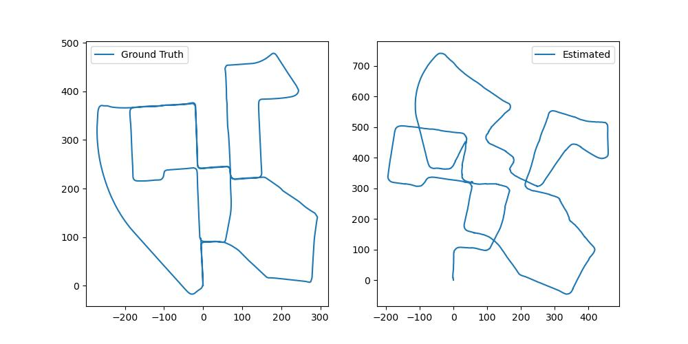

# Visual Odometry with the KITTI Dataset 🚗💨

Welcome to the **Visual Odometry** project! This project demonstrates the process of estimating the trajectory of a vehicle by analyzing sequences of images from the KITTI dataset. Leveraging computer vision techniques, this project provides an end-to-end pipeline that includes calibration, feature detection, feature matching, pose estimation, and trajectory visualization.

## Project Overview 📜

Visual Odometry (VO) refers to the process of estimating the movement (i.e., trajectory) of a camera by analyzing a sequence of images. This project applies VO to the KITTI dataset, a widely-used benchmark dataset in autonomous driving research.

### Key Components 🔍

1. **tools.py** 🛠️
   - This module contains essential utility functions that are used throughout the project.
   
   - **`read_calib(path_calib_seq)`**: This function reads the intrinsic parameters and the projection matrix from the calibration files. These parameters are crucial for accurately interpreting the images captured by the camera.
   - **`read_pose(pose)`**: This function extracts the rotation matrix and translation vector from the pose data, which represent the orientation and position of the camera at each time step.
   - **`transf_hom(rotation, translation)`**: This function converts the rotation and translation into a homogeneous transformation matrix, making it easier to apply transformations consistently across the project.
   - **`get_matches(img1, img2)`**: This function detects features in two consecutive frames and finds corresponding points between them. It uses the ORB (Oriented FAST and Rotated BRIEF) detector for feature extraction and a FLANN-based matcher to find correspondences, ensuring efficient and accurate feature matching.
   - **`get_pose(pts1, pts2, cameraMatrix)`**: This function computes the essential matrix from corresponding points and recovers the relative rotation and translation between the two frames, crucial for building the camera's trajectory.
   - **`drawBannerText(frame, text)`**: A simple function to annotate frames with a banner displaying custom text, making it easier to visualize information on the frames during processing.

2. **visualize_data.py** 👁️
   - This script provides a quick way to visualize sequences from the KITTI dataset. It displays each frame with an overlay banner showing the frame number. This helps in understanding the dataset and verifying that the frames are read and processed correctly.

3. **visual_odometry.py** 🚀
   - The main script where all the components come together to perform visual odometry on the KITTI dataset.
   
   - **Calibration**: The script starts by reading the camera's intrinsic parameters from the calibration file using the `read_calib` function.
   - **Frame Processing**: For each frame in the sequence, the script finds corresponding features with the previous frame using the `get_matches` function.
   - **Pose Estimation**: The script then calculates the relative pose (rotation and translation) between consecutive frames with the `get_pose` function. These poses are accumulated to estimate the trajectory of the camera.
   - **Trajectory Visualization**: The estimated trajectory is stored and compared against the ground truth trajectory, with the results plotted and displayed at the end.

4. **Jupyter Notebook** 📝
   - The notebook provides an interactive overview of the major components of the project. It includes visualizations of feature detection, feature matching, and pose recovery, making it easier to understand the core steps in the visual odometry pipeline.

## Getting Started 🚀

1. **Install Dependencies**: Ensure you have the necessary Python packages installed. You can do this via pip:
   ```bash
   pip install numpy pandas opencv-python matplotlib
   ```

2. **Run the Visualization**: Use the `visualize_data.py` script to visualize the sequences from the KITTI dataset:
   ```bash
   python visualize_data.py
   ```

3. **Perform Visual Odometry**: Execute the `visual_odometry.py` script to estimate the vehicle's trajectory:
   ```bash
   python visual_odometry.py
   ```

4. **Explore the Notebook**: Open the Jupyter notebook to dive into the components interactively:
   ```bash
   jupyter notebook
   ```

## Bundle adjustment
Soon... 🚧🚧🚧 

## Results 📈

At the end of the pipeline, you'll have a visualization comparing the estimated trajectory against the ground truth trajectory. This allows you to assess the accuracy of the visual odometry process.



## Acknowledgments 🙌

This project is built using the KITTI dataset, a standard benchmark in the field of autonomous driving research. The tools and techniques implemented here draw upon well-established methods in computer vision, including feature detection, matching, and pose estimation.
