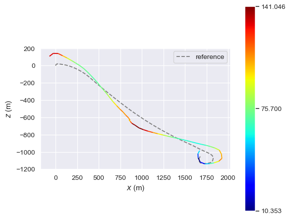

# 🧭 Monocular Visual Odometry with SLAM

Welcome to a minimal and modular implementation of a **Monocular Visual SLAM Frontend**! This project uses classical techniques for tracking camera motion from a single RGB input sequence. 

> ⚠️ This project is designed for research and educational purposes on top of the KITTI dataset.

---

## 🧠 Main Features

- 📷 **Monocular Tracking** – Supports RGB-only visual odometry with no depth sensors.
- 🧩 **ORB Feature Matching** – Classical feature extraction and matching for initial pose estimation.
<!-- - 📌 **Keyframe-based SLAM Frontend** – Efficient tracking with on-the-fly keyframe insertion. -->
<!-- - 🧠 **Pose Optimization** – Differentiable pose refinement using gradients and rendering losses. -->
- 🎥 **Live Visualizations** – Optionally render tracking video with visualized keypoints.
- 📊 **ATE Evaluation** – Trajectory evaluation using Absolute Trajectory Error (ATE).
- 🔬 **WandB Integration** – Logs performance metrics like RMSE ATE and FPS.


## 🚀 Getting Started

### 1. 🔧 Install Dependencies

Set up your environment (ideally with `conda`) and install:

```bash
pip install -r requirements.txt
```

### 2. ⚙️ Run the Tracker

```bash
python main.py --config configs/kitti_sequences/kitti_00.yaml
```

If you want to **evaluate** and log results:

```bash
python main.py --config configs/kitti_sequences/kitti_01.yaml --eval
```

---

## 📁 Configuration

Modify your YAML config file to point to the correct KITTI dataset path and tune parameters such as:
<!-- - `tracking_itr_num` -->
- `max_num_features`
<!-- - `kf_overlap`, `kf_translation`, `kf_min_translation` -->
- `render_video`, `save_results`, `use_wandb`

---

## 📊 Example Output

Demo on the "01" kitti sequence

<video src="assets/feature_tracking_output.mp4" controls autoplay loop width="600"></video>



---

## 🧪 Dataset

📦 This project uses [KITTI Odometry Dataset](http://www.cvlibs.net/datasets/kitti/eval_odometry.php)  
Make sure your sequence folder follows the expected format.

---

## 🙌 Acknowledgements

This project was build on top of some very useful **OpenCV** functionalities.

---

## 📌 To-Do

- [ ] Add back-end mapping module
- [ ] Add keyframe-aware heuristics 
- [ ] CUDA acceleration for faster tracking
- [ ] Monocular depth priors

---

## 🧑‍💻 Author

Made with ❤️ by a computer vision enthusiast.  
Feel free to open an issue or pull request!
